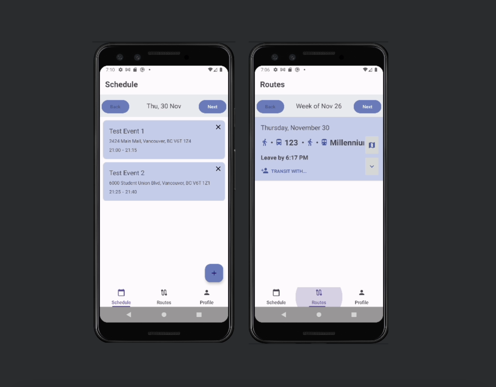

# RouteRider - Friend Commuting Android App

Welcome to the RouteRider repository – an Android application developed with Java and Android Studio, featuring Google Sign-In, Maps, and Calendar integration. This app facilitates seamless transit planning, offering an intuitive user interface with dynamic tabs for efficient navigation. The backend, powered by JavaScript, Node.js, and Azure, includes algorithms for optimal transit routes, user matching, collaborative commuting, and personalized points of interest suggestions during downtime. 
